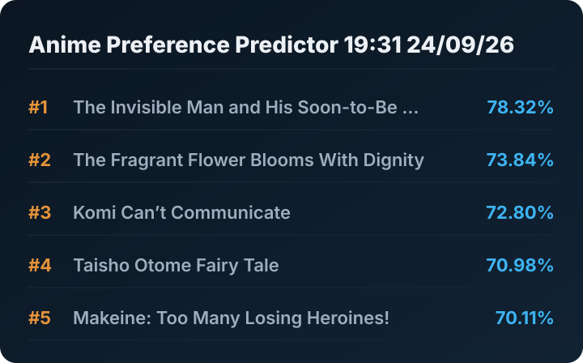

(new repository since the old one got ruined with 1,500 automated commits)

to-do list:
- get every anime on my profile in an arranged manner with custom classes (entry class)
- get all the tags and make a separate tag_score class that can take many entry classes and calculate score on demand
- calculate the 4 factors of amount_of_tag_in_show, completion_weight, run_time_in_hours, and decay_factor separately
- combine them and add them across each anime to score each tag individually
- give scores to every anime on the planning list
- normalise by setting best as 100% and median as 50%
- add a backend function that returns an ordered dictionary version of the widget
- set up a primitive widget frontend that requests the data and calculation whenever it loads
- add caching to the widget
- clean it up and add it to anilist
